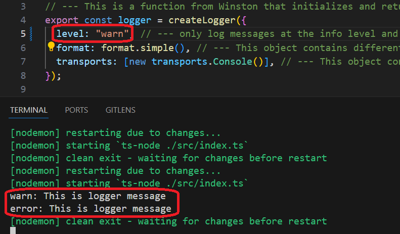

<h1>Super Simple Usage of Node.js Logger</h1>

<h2>Motivation</h2>
<p>Winston is a versatile and popular Node.js logging library. This guide demonstrates the most minimal usage to help you get started quickly with logging in your applications.</p>

<h2>Installation</h2>

```bash
pnpm i winston
```

Alternatively, npm can also be used:

<h2>Usage</h2>

```bash
npm run dev
```

<h3>index.ts</h3>

```ts
import { logger } from "./logger";

const msg: string = "This is logger message";

// This is for very detailed and low-level messages,
   often not necessary for everyday use
logger.silly(msg,"Silly : Hello, Winston logger in TypeScript!");

// This is for detailed debugging information
logger.verbose("Verbose : Hello, Winston logger in TypeScript!");

// This is for debugging messages.
logger.debug("Debug : Hello, Winston logger in TypeScript!");

// This is for informational messages
logger.info("Info : Hello, Winston logger in TypeScript!");

// This is for warning messages
logger.warn("Warning : Hello, Winston logger in TypeScript!");

// This is for error messages
logger.error("Error : Hello, Winston logger in TypeScript!");

```

<h3>logger.ts</h3>

```ts
// --- A function from Winston that initializes and returns
// --- a new logger instance.
export const logger = createLogger({
  // --- Logs only messages at the info level and higher (e.g., warn, error)
  // --- will be logged. Levels below info (like debug) will be ignored.
  level: "info",
  // --- This object contains different formatting options for your logs
  format: format.simple(),
  // --- This object contains different transport mechanisms for your logs
  // --- (e.g., console, files, remote servers).
  transports: [new transports.Console()],
});
```

<h2>Demo</h2>

<h3>Log Level is High</h3>

setting level to 'warn' in createLogger produces the following



<h3>Log Level is Low</h3>

setting level to 'verbose' in createLogger produces the following


<h2>Points of Interest</h2>
  <h3>More about log level</h3>
    <table>
  <thead>
    <tr>
      <th>Level</th>
      <th>Priority</th>
      <th>Use Case</th>
    </tr>
  </thead>
  <tbody>
    <tr>
      <td><code>error</code></td>
      <td>Highest</td>
      <td>Critical issues, e.g., app crashes</td>
    </tr>
    <tr>
      <td><code>warn</code></td>
      <td>High</td>
      <td>Recoverable issues, e.g., deprecation warnings</td>
    </tr>
    <tr>
      <td><code>info</code></td>
      <td>Medium</td>
      <td>General app flow</td>
    </tr>
    <tr>
      <td><code>verbose</code></td>
      <td>Low</td>
      <td>Detailed app flow, e.g., function calls</td>
    </tr>
    <tr>
      <td><code>debug</code></td>
      <td>Lower</td>
      <td>Debugging info</td>
    </tr>
    <tr>
      <td><code>silly</code></td>
      <td>Lowest</td>
      <td>Extra debugging or verbose data</td>
    </tr>
  </tbody>
</table>


  <h3>log level enum</h3>
  You might want to use this enum for specifying the log level in `createLogger`.

  ```ts
  export enum WinstonLogLevel {
    // --- do not change value
    ERROR = "error",
    WARN = "warn",
    INFO = "info",
    VERBOSE = "verbose",
    DEBUG = "debug",
    SILLY = "silly",
  }
  ```

<h3>logger format</h3>
You can tweak it by adding features like timestamps.

<h2>References</h2>
<ul>
    <li><a href='https://github.com/winstonjs/winston'>official documentation</a></li>
</ul>
