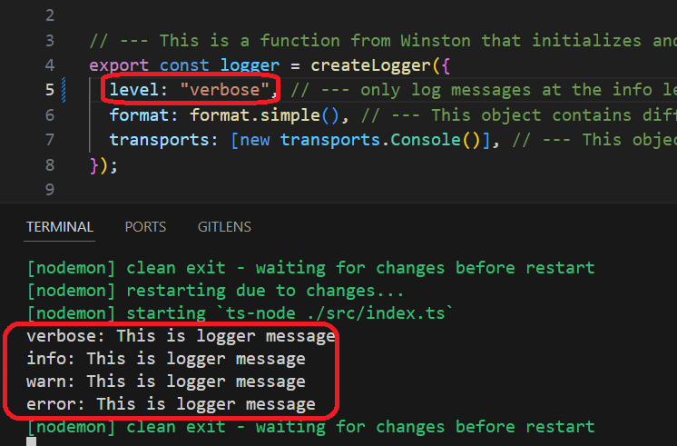

<h1>Subject</h1>
Super simple usage of node.js logger 

<h2>Motivation</h2>
Provide most minimal usage of node logger - winston


<h2>Installation</h2>

```bash
pnpm i winston
```
npm can also be used

<h2>Usage</h2>

```bash
npm run dev
```


<h3>index.ts</h3>

```ts
import { logger } from "./logger";

const msg: string = "This is logger message";

// This is for very detailed and low-level messages, 
   often not necessary for everyday use 
logger.silly(msg,"Silly : Hello, Winston logger in TypeScript!"); 

// This is for detailed debugging information
logger.verbose("Verbose : Hello, Winston logger in TypeScript!");

// This is for debugging messages. 
logger.debug("Debug : Hello, Winston logger in TypeScript!");

// This is for informational messages 
logger.info("Info : Hello, Winston logger in TypeScript!"); 

// This is for warning messages
logger.warn("Warning : Hello, Winston logger in TypeScript!");

// This is for error messages
logger.error("Error : Hello, Winston logger in TypeScript!");

```

<h3>logger.ts</h3>

```ts
// --- This is a function from Winston that initializes and returns 
// --- a new logger instance.
export const logger = createLogger({
  // --- only log messages at the info level and higher (e.g., warn, error) 
  // --- will be logged. Levels below info (like debug) will be ignored. 
  level: "info", 
  // --- This object contains different formatting options for your logs
  format: format.simple(), 
  // --- This object contains different transport mechanisms for your logs 
  // --- (e.g., console, files, remote servers).
  transports: [new transports.Console()], 
});

```


<h2>Demo</h2>

<h3>log level is high</h3>

setting level to 'warn' in createLogger will produce the following


<h3>log level is low</h3>

setting level to 'verbose' in createLogger will produce the following



<h2>Points of Interest</h2>
<ul>
  <li>log level priority from highest to lowest</li>
    error , warning, info , verbose , debug , silly

  <li>log level enum</li>
    you might want to use this enum for log level in createLogger

    ```ts
    export enum WinstonLogLevel {
      // --- do not change value
      ERROR = "error",
      WARN = "warn",
      INFO = "info",
      VERBOSE = "verbose",
      DEBUG = "debug",
      SILLY = "silly",
    }
    ```

  <li>logger format</li>
  You can tweak it an add e.g. timestamp
</ul>

<h2>References</h2>
<ul>
    <li><a href='https://github.com/winstonjs/winston'>official documentation</a></li>
</ul>

